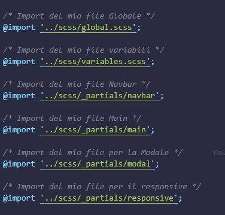

# Progetto Social Media | Full Responsive

Progetto replica di un social Network. In questo esercizio ho replicato, tramite tecnologie `front-office` un social media `full-responsive`.
In questo esercizio ho avuto modo di acquisire `nuove conoscenze` e `competenze` riguardo al `front-office`, come :

-  `Live Sass Compiler` : Mi ha permesso di abilitare l'estensione per il linguaggio `css` rendendo il tutto più `professionale` e `gradevole`.
-  `Javascript Modules` : Mi ha dato modo di suddividere i compiti tra svariati file `javascript`. in particolare:
   -  Un file solo per le `funzioni`.
   -  Un file solo per la `modale` del tema.
   -  Un file `principale` dove sono state richiamate `funzioni` della `modale` e della manipolazione del `DOM`.

### Risultato versione Desktop (1440px)


### Risultato versione Desktop + piccoli (1200px)


### Risultato versione Tablet Grandi (992px)


### Assets | SCSS

Come già accennato grazie al `Live Sass Compiler` ho potuto utilizzare al meglio la versione di `css` utilizzando variabili ed `elementi radice (:root)` per la manipolazione del tema `chiaro/scuro`. In questo caso ho pensato a suddividere i file in tal modo :

-  `style.scss` : Mio file principale dove vengono `importati` tutti gli altri stili. E' il file `predisposto` dal compiler per la `"traduzione"` a normale `css`.

   

-  `global.scss` : Mio file dove vengono `impostate` tutte le classi che vengono richiamate più volte.
-  `variable.scss` : File principale dove vengono richiamate tutte le `variabili` per `palette/dimensione/colori` etc.

   

-  cartella `partials` : Cartella dove ho suddiviso in base alle sezioni del mio `markup`.

   

### Assets | JSON

Cartella che contiene file predisposti per la `manipolazione DOM`. In questo modo, tramite chiamate `fetch/await` nelle singole `async functions` a questi file (`array di oggetti`) ho potuto iniettare dinamicamente:

-  `Notifiche` : Tutte le notifiche del mio `pop-up`.
-  `Feeds` : I feeds della mia pagina già pre-impostati.
-  `Stories` : Le stories già pre-impostate.

### Assets | JAVASCRIPT

Come già accennato grazie alla possibilità di suddividere il mio file `Javascript` per `moduli` ho potuto creare :

-  `function.js` : Luogo dove ho impostato tutte le mie `funzioni` come :

   -  `async function` : Necessarie per `iniettare` dinamicamente i dati dai miei file JSON. esempio:

   ```javascript
   export async function getData(url) {
      /* I save my JSON link on my Response */
      const response = await fetch(url);
      let data = "";
      /* Started API Call to my JSON file */
      try {
         data = await response.json();
         // console.log(data); // I look into the console
         return data; // i need to return my data
      } catch (error) {
         // Take the error if needed
         console.error(error); // I look into the console
      }
      return response; // I need to return my response
   }
   ```

   -  `funzioni semplici` : Funzioni che mi sono servite per richiamare più volte elementi dal `DOM`. Penso ad `div/classi/id` etc. Esempio:

   ```js
   export function querySelectorAll(element) {
      return document.querySelectorAll(element);
   }
   ```

   -  `funzioni complesse` : Funzioni sicuramente più complicate che mi sono servite per `filtrare` i messaggi o `rimuovere` classi attive e passarlo ai successori. Esempio :

   ```js
   export const searchMessage = () => {
      const val = messageSearch.value.toLowerCase(); // Salvo l'input dell'utente
      console.log(val); // Verifico in console
      // Eseguo un loop su tutti i messaggi della chat
      message.forEach((chat) => {
         let name = chat.querySelector("h5").textContent.toLowerCase(); // Selezioni i miei nomi
         if (name.indexOf(val) != -1) {
            chat.style.display = "flex";
         } else {
            chat.style.display = "none";
         }
      });
   };
   ```

Questi sono gli screen dei miei file javascript.

`app.js`


`function.js`


### Funzionalità

Ho avuto modo di aggiungere svariate `funzionalità` all'interno del prodotto, tra cui :

-  `filtro messaggi` : Tramite ricerca nella `search-bar` dedicata ho avuto modo di `filtrare` i messaggi ricevuti dall'utente.

   `Messaggi standard`

   

   `Messaggi Filtrati`

   

-  `Suddivisione Box Messaggi` : Tramite funzione di Javascript sono riuscito a sistemare in modo `equo` lo spazio suddiviso per `Primari/Generale/Richieste`. Come ? Manipolando lo stile associato a tutta la sezione grazie a questa `function`:

```js
categoriesZone.forEach((category) => {
   // Seleziono la mia classe general e la disattivo da subito
   const generalBox = document.querySelector(".generalBox");
   generalBox.style.display = "none"; // La disattivo da subito
   // Seleziono la mia classe richieste e la disattivo da subito
   const requestBox = document.querySelector(".requestBox");
   requestBox.style.display = "none"; // La disattivo da subito

   category.addEventListener("click", () => {
      removeCategoriesSelector(); // Funzione per disattivare classe attiva
      category.classList.toggle("active"); // La riattivo al click
      // Condizione per i messaggi
      if (category.classList.contains("primary")) {
         // Tramite for of attivo la proprietà flex a tutti
         setTimeout(() => {
            for (const single of message) single.style.display = "flex";
            generalBox.style.display = "none";
            requestBox.style.display = "none";
         }, 100);
      }
      // Condizione per il general
      else if (category.classList.contains("general")) {
         // Messo tutto dentro un intervallo di 200ms
         setTimeout(() => {
            // Tramite for of attivo la proprietà none a tutti
            for (const single of message) single.style.display = "none";
            generalBox.style.display = "flex";
            requestBox.style.display = "none";
         }, 100);
      }
      // Condizione per le richieste
      else if (category.classList.contains("message-requests")) {
         setTimeout(() => {
            for (const single of message) single.style.display = "none";
            generalBox.style.display = "none";
            requestBox.style.display = "flex";
         }, 100);
      }
      // Aggiungo la classe Active
      category.classList.add("active");
   });
});
```

In pratica ad ogni click su una `categoria` ho avuto la possibilità di nascondere quella `non idonea` per la task, quindi se dovesserò servirmi soltanto le richieste ho rimosso la proprietà `display` a `Primari/Generale`. Anche per rimuovere il `bordo` attivo ho usato una `function`

`Primari`


`Generali`


`Richieste`

Per le richieste c'è da aggiungere una nota, poichè anche in questo caso, per ogni `singola` richiesta sono riuscito a `gestire` i tasti `accetta` e `declina`. Ad ognuno dei pulsanti è stato aggiunto un `evento` che gestisce al click una situazione `specifica`. Al click su `accetta` verrà scatenato un metodo che mi darà un `messaggio` di avvenuto `successo` mentre avverrà il caso `contrario` su `declina`.

```js
// Avvio ciclo sui tasti accetta
accept.addEventListener("click", () => {
   successMessage.style.display = "flex"; // Attivo la classe per accettare
   // Avvio il mio timeout per far scomparire entrambi
   setTimeout(() => {
      successMessage.style.display = "none";
      requestBox[i].style.display = "none";
   }, 1000);
});
// Avvio ciclo sui tasti decline
decline.addEventListener("click", () => {
   declineMessage.style.display = "flex"; // Attivo la classe per declinare
   // Avvio il mio timeout per far scomparire entrambi
   setTimeout(() => {
      declineMessage.style.display = "none";
      requestBox[i].style.display = "none";
   }, 1000);
});
```


